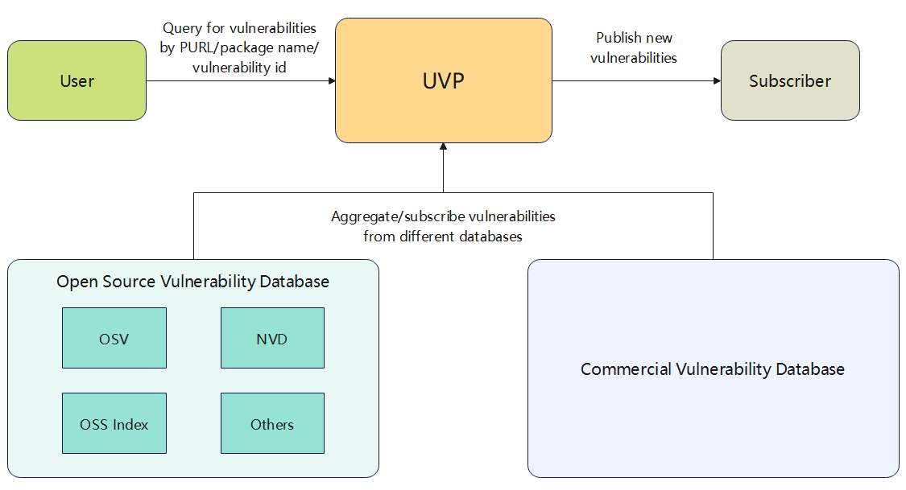

# Architecture

Below is a general architecture diagram:

UVP aggregates and/or subscribes vulnerabilities from multiple open source and/or
commercial vulnerability databases, processes and then stores them in a database.

Users can query vulnerabilities via API or website.
Additionally, subscription to new vulnerabilities is also supported.

---
[Back to the README](../README.md)
