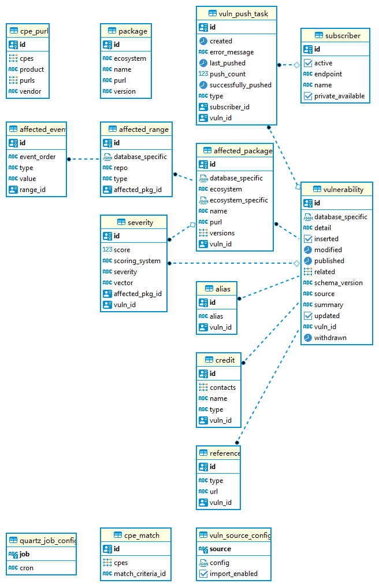

# Data Model

Below is a general data model diagram:

The data model of UVP mainly complies with [Open Source Vulnerability schema](https://ossf.github.io/osv-schema/),
such as `affected_packages`, `reference`, and the remaining entities serve for other purposes.

---
[Back to the README](../README.md)
